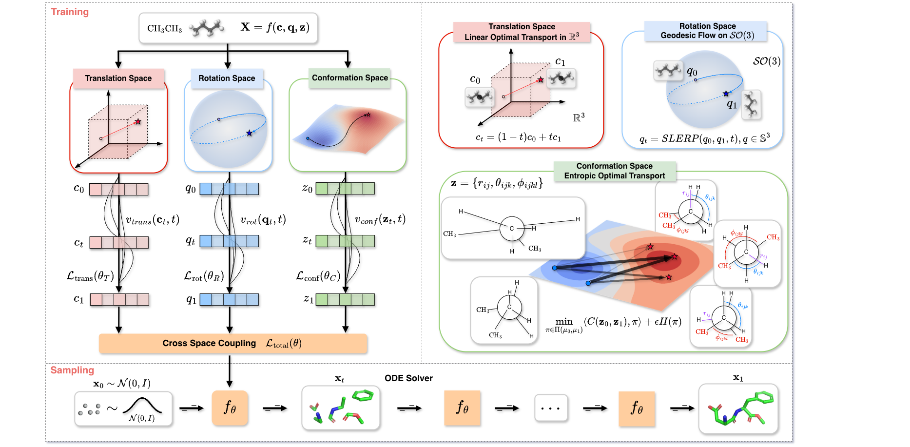

# GO-Flow

This repository is the official implementation of “Geometric Flow Matching for Molecular Conformation Generation via Manifold Decomposition”.


## Installation
- Clone this repository
>  git clone


## Training

```shell
python train_go_flow.py config/drugs_go_flow.yml --device cuda
```
